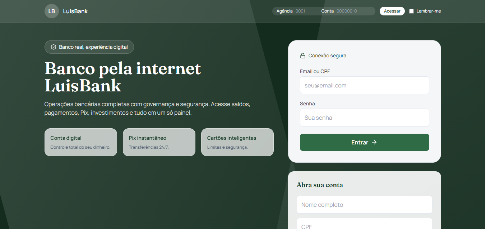
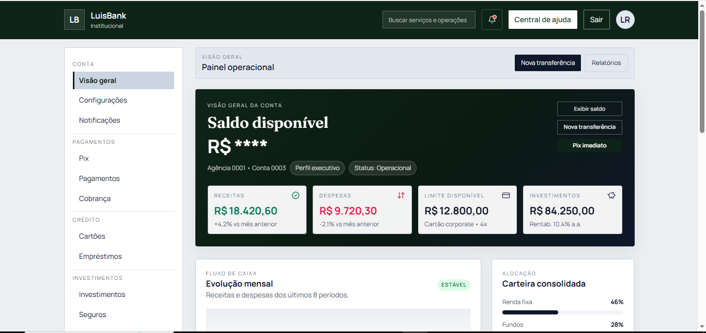
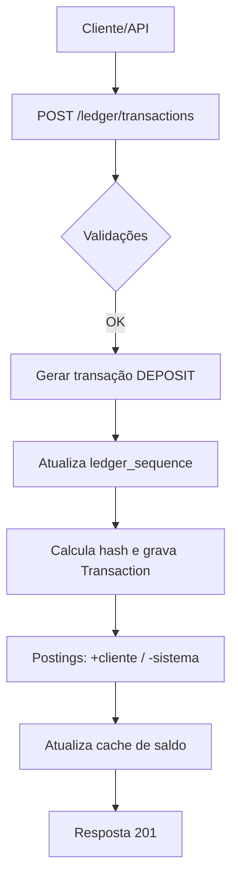
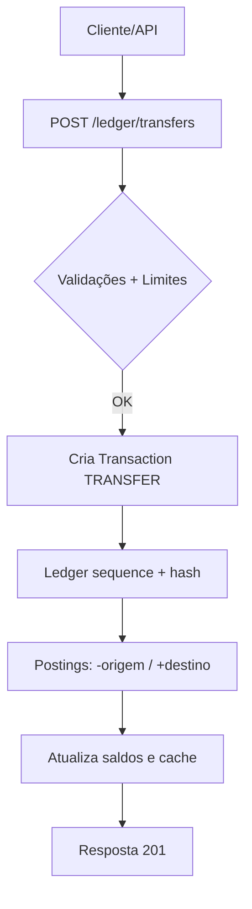
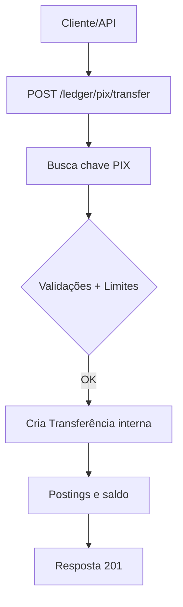
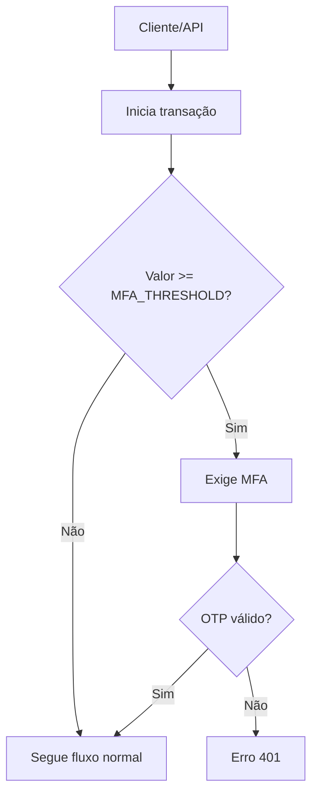
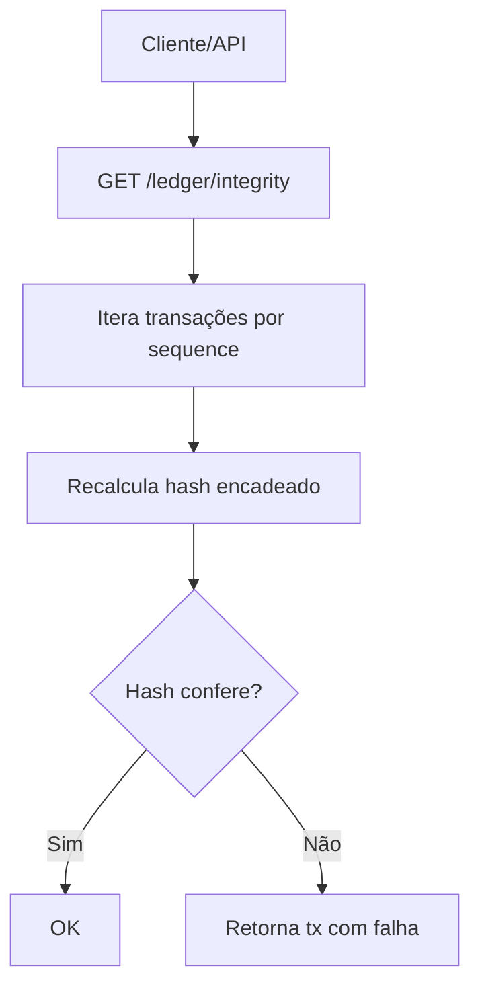
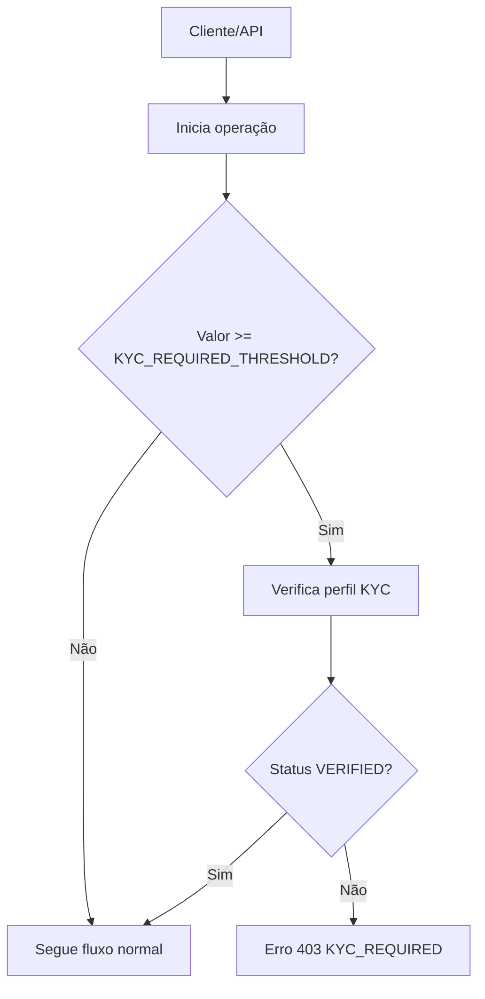
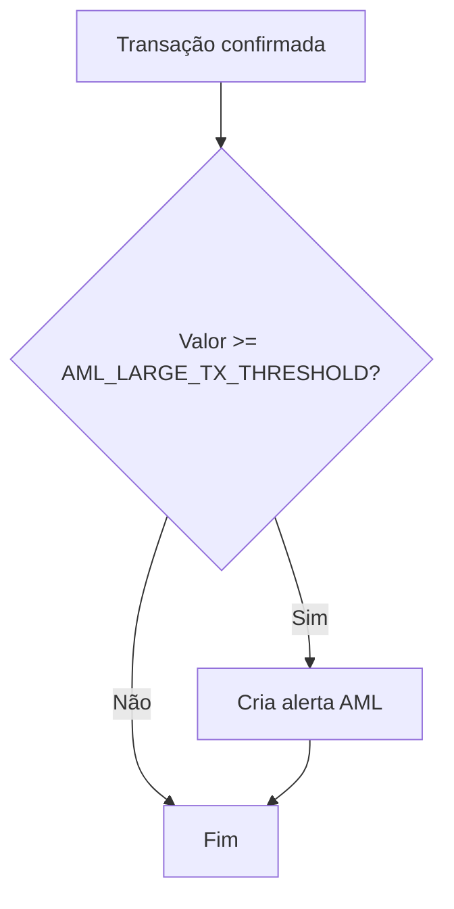
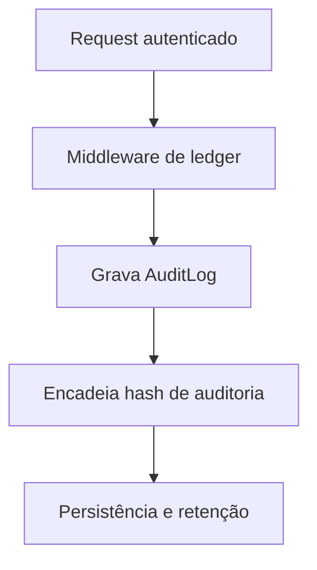

# LuisBank — Plataforma de Banco Digital e Ledger Imutável

## Visão geral
O **LuisBank** é uma plataforma de banco digital com **ledger imutável**, serviços de core banking, camada regulatória e observabilidade completa. O projeto integra API, frontend institucional, serviços de segurança/compliance e infraestrutura de dados para operações financeiras de alta confiabilidade.

## Interface (capturas da plataforma)




## Escopo funcional (visão completa)
### Core Banking & Ledger
- **Contas** (corrente, digital, poupança, investimento) com saldo, saldo bloqueado e limite de cheque especial.
- **Ledger append-only** com trilha de auditoria e encadeamento por hash (sequência, `prev_hash`, `record_hash`).
- **Transações**: depósito, saque, transferência interna, PIX.
- **Postings** contábeis (débito/crédito) com reconciliação baseada em soma de lançamentos.
- **Extrato** e saldo em tempo real com cache de leitura.

### Pagamentos
- **PIX** (chaves, transferências, validações e limites).
- **Pagamentos** (boletos e operações internas de transferência).
- **Cobrança** e fluxos de billing internos.

### Cartões
- **Cartões virtuais** com emissão, bloqueio/desbloqueio e controles (online, internacional, contactless).
- **Transações de cartão** e **faturas**.

### Investimentos & Crédito
- Produtos de investimento (ex.: CDB, Tesouro, Fundos).
- **Empréstimos** com cálculo de limite e simulação de operações.

### Segurança, Identidade & Autenticação
- **Login com MFA** (TOTP) e backup codes.
- **Step‑up authentication** para transações acima do threshold configurado.
- Tokenização e criptografia de dados sensíveis (ex.: CPF).
- Detecção de **novo dispositivo** e criação automática de alertas.

### Compliance, Auditoria & Regulatório
- **KYC** (perfil e verificação obrigatória para operações de alto valor).
- **AML** (alertas para transações acima do limite).
- **Auditoria** com logs e integridade de ledger.
- Relatórios regulatórios (SCR, COAF) e trilha de conformidade.

### Observabilidade & Operações
- **Métricas Prometheus** e dashboards Grafana.
- **Tracing** com Jaeger.
- **Logs centralizados** (Elastic + Logstash + Kibana).
- **Alertas** (Alertmanager) e roteamento para canais externos.

### Dados & Analytics
- **Airflow** para pipelines.
- **Metabase** para BI.
- **dbt** para transformações no data warehouse.

## Componentes de UI (Frontend)
- Dashboard operacional (saldo, extrato, ações rápidas, compliance).
- Pix, pagamentos, cartões, crédito, investimentos, seguros, PJ, Open Finance.
- Compliance e segurança (LGPD, fraude, regulatório, observabilidade).

## Arquitetura (alto nível)
- **API Ledger** (FastAPI) + **PostgreSQL** + **Redis**.
- **Ledger** com transações e postings e encadeamento hash.
- **Infra de observabilidade** completa (Prometheus, Grafana, Jaeger, ELK).
- **Mensageria/Jobs** com Celery + Redis.
- **Vault** para segredos e chaves.

## Principais endpoints (API)
Base: `/ledger`
- `POST /auth/login` — login + MFA
- `GET /accounts/me` — dados da conta
- `GET /accounts/{id}/balance` — saldo
- `GET /accounts/{id}/statement` — extrato
- `POST /transactions` — depósito/saque
- `POST /transactions/transfer` — transferências
- `POST /pix/transfer` — PIX
- `GET /ledger/integrity` — validação de integridade

## Infraestrutura local (Docker)
Serviços principais no `docker-compose.yml`:
- **ledger_api** (FastAPI)
- **ledger_db** (PostgreSQL)
- **ledger_redis** (Redis)
- **ledger_vault** (Vault)
- **nginx** (gateway)
- Observabilidade: Prometheus, Grafana, Jaeger, ELK
- Analytics: Airflow, Metabase, dbt
- Storage: MinIO + backup

### Como subir (ambiente local)
```bash
# na raiz do projeto
docker compose up -d
```

### Frontend
```bash
cd frontend
npm install
npm run dev
```

## Credenciais de dev (seed)
Quando `SEED_DEV=true`:
- **Email**: `dev@luisbank.local`
- **Senha**: `dev123`
- **Conta**: `0001-0`

## Principais regras de negócio
- Ledger **append-only**: updates/deletes são bloqueados via hooks.
- Saldo calculado por soma de postings (com cache temporário).
- MFA obrigatório acima de `MFA_THRESHOLD_UNITS`.
- KYC exigido acima de `KYC_REQUIRED_THRESHOLD`.
- Alertas AML acima de `AML_LARGE_TX_THRESHOLD`.

## Fluxos (Mermaid)
### Depósito


### Transferência interna


### PIX


### MFA / Step‑up Auth


### Integridade do ledger


### KYC (verificação para alto valor)


### AML (alerta para transações relevantes)


### Auditoria (trilha e integridade)


## Segurança & Conformidade
- Dados sensíveis criptografados e tokenizados.
- Trilha de auditoria com integridade por hash.
- Detecção de fraude e limites por operação.

---

**Status**: plataforma funcional com módulos completos de core banking, compliance e observabilidade.
